# Architecture Overview

## System Architecture

This document describes the architecture of the Isovalent Enterprise Platform integrated with Splunk Observability Cloud on Amazon EKS.

## High-Level Architecture Diagram

### Mermaid Diagram

```mermaid
graph TB
    subgraph AWS["Amazon Web Services"]
        subgraph EKS["EKS Cluster - isovalent-demo"]
            subgraph CP["Control Plane"]
                API["Kubernetes API Server"]
            end
            
            subgraph NG["Worker Nodes (m5.xlarge)"]
                subgraph Node1["Node 1"]
                    CA1["Cilium Agent<br/>(eBPF + ENI)<br/>:9962"]
                    CE1["Cilium Envoy<br/>:9964"]
                    HA1["Hubble<br/>:9965"]
                    TE1["Tetragon<br/>:2112"]
                    OC1["OTel Collector<br/>Agent"]
                    PODS1["Application Pods"]
                end
                
                subgraph Node2["Node 2"]
                    CA2["Cilium Agent<br/>(eBPF + ENI)<br/>:9962"]
                    CE2["Cilium Envoy<br/>:9964"]
                    HA2["Hubble<br/>:9965"]
                    TE2["Tetragon<br/>:2112"]
                    OC2["OTel Collector<br/>Agent"]
                    PODS2["Application Pods"]
                end
            end
            
            subgraph CS["Cluster Services"]
                CO["Cilium Operator<br/>:9963"]
                HR["Hubble Relay"]
                HT["Hubble Timescape<br/>(Historical Flows)"]
                DNS["DNS Proxy HA"]
                CD["CoreDNS"]
            end
        end
        
        subgraph VPC["VPC Networking"]
            ENI["Elastic Network Interfaces<br/>(Prefix Delegation)"]
        end
    end
    
    subgraph Splunk["Splunk Observability Cloud"]
        IM["Infrastructure Monitoring"]
        APM["APM"]
        DB["Dashboards"]
    end
    
    %% Data Flow Connections
    CA1 -.->|"Scrape :9962"| OC1
    CE1 -.->|"Scrape :9964"| OC1
    HA1 -.->|"Scrape :9965"| OC1
    TE1 -.->|"Scrape :2112"| OC1
    
    CA2 -.->|"Scrape :9962"| OC2
    CE2 -.->|"Scrape :9964"| OC2
    HA2 -.->|"Scrape :9965"| OC2
    TE2 -.->|"Scrape :2112"| OC2
    
    CO -.->|"Scrape :9963"| OC1
    CO -.->|"Scrape :9963"| OC2
    
    OC1 ==>|"OTLP/HTTP<br/>Metrics"| IM
    OC2 ==>|"OTLP/HTTP<br/>Metrics"| IM
    
    IM --> DB
    
    %% Networking Connections
    CA1 <-->|"Manages"| ENI
    CA2 <-->|"Manages"| ENI
    ENI -->|"VPC IPs"| PODS1
    ENI -->|"VPC IPs"| PODS2
    
    %% Hubble Flow Aggregation
    HA1 -->|"Flow Data"| HR
    HA2 -->|"Flow Data"| HR
    HR --> HT
    
    %% API Communication
    CA1 -.->|"kube-proxy<br/>replacement"| API
    CA2 -.->|"kube-proxy<br/>replacement"| API
    CO --> API
    
    %% DNS
    PODS1 --> DNS
    PODS2 --> DNS
    DNS --> CD
    
    classDef cilium fill:#f9f,stroke:#333,stroke-width:2px
    classDef hubble fill:#9cf,stroke:#333,stroke-width:2px
    classDef tetragon fill:#fcf,stroke:#333,stroke-width:2px
    classDef otel fill:#ff9,stroke:#333,stroke-width:2px
    classDef splunk fill:#6f6,stroke:#333,stroke-width:2px
    classDef aws fill:#fa0,stroke:#333,stroke-width:1px
    
    class CA1,CA2,CO,CE1,CE2 cilium
    class HA1,HA2,HR,HT hubble
    class TE1,TE2 tetragon
    class OC1,OC2 otel
    class IM,APM,DB splunk
    class ENI aws
```



### ASCII Diagram

```
┌─────────────────────────────────────────────────────────────────────────────┐
│                          Splunk Observability Cloud                         │
│                                  (us1 realm)                                 │
│                                                                              │
│  ┌──────────────┐  ┌──────────────┐  ┌──────────────┐  ┌──────────────┐   │
│  │   Metrics    │  │   Dashboards │  │    Alerts    │  │   Analytics  │   │
│  └──────────────┘  └──────────────┘  └──────────────┘  └──────────────┘   │
└─────────────────────────────────────────────────────────────────────────────┘
                                    ▲
                                    │ OTLP/HTTP
                                    │ (TLS encrypted)
                                    │
┌─────────────────────────────────────────────────────────────────────────────┐
│                   Splunk OpenTelemetry Collector                            │
│                          (otel-splunk namespace)                            │
│                                                                              │
│  ┌────────────────────────────────────────────────────────────────────┐    │
│  │                    Metrics Processing Pipeline                      │    │
│  │  ┌──────────┐  ┌──────────┐  ┌──────────┐  ┌──────────┐          │    │
│  │  │ Receivers│─▶│Processors│─▶│ Exporters│─▶│  Batch   │          │    │
│  │  └──────────┘  └──────────┘  └──────────┘  └──────────┘          │    │
│  └────────────────────────────────────────────────────────────────────┘    │
│                                                                              │
│  Prometheus Receivers (Kubernetes Service Discovery):                       │
│  • prometheus/isovalent_cilium    (port 9962, 9965)                        │
│  • prometheus/isovalent_envoy     (port 9964)                              │
│  • prometheus/isovalent_operator  (port 9963)                              │
│  • prometheus/isovalent_tetragon  (port 2112)                              │
│  • kubeletstats, hostmetrics                                               │
└─────────────────────────────────────────────────────────────────────────────┘
                    ▲           ▲           ▲           ▲
                    │           │           │           │
              :9962 │     :9965 │     :9964 │     :2112 │
              :9963 │           │           │           │
                    │           │           │           │
┌─────────────────────────────────────────────────────────────────────────────┐
│                        Amazon EKS Cluster (1.30)                            │
│                          VPC: 192.168.0.0/16                                │
│                                                                              │
│  ┌─────────────────────────── kube-system ─────────────────────────────┐   │
│  │                                                                       │   │
│  │  ┌───────────────┐  ┌───────────────┐  ┌───────────────┐           │   │
│  │  │ Cilium Agent  │  │ Cilium Agent  │  │ Cilium Operator│          │   │
│  │  │  (DaemonSet)  │  │  (DaemonSet)  │  │  (Deployment)  │          │   │
│  │  │               │  │               │  │                 │          │   │
│  │  │ • CNI         │  │ • CNI         │  │ • Cluster Mgmt │          │   │
│  │  │ • BPF/eBPF    │  │ • BPF/eBPF    │  │ • Policy       │          │   │
│  │  │ • ENI Mode    │  │ • ENI Mode    │  │                 │          │   │
│  │  │ • Metrics:9962│  │ • Metrics:9962│  │ • Metrics:9963  │          │   │
│  │  └───────────────┘  └───────────────┘  └───────────────┘           │   │
│  │          │                  │                                        │   │
│  │  ┌───────────────┐  ┌───────────────┐                              │   │
│  │  │ Cilium Envoy  │  │ Cilium Envoy  │                              │   │
│  │  │  (DaemonSet)  │  │  (DaemonSet)  │                              │   │
│  │  │               │  │               │                               │   │
│  │  │ • L7 Proxy    │  │ • L7 Proxy    │                              │   │
│  │  │ • Metrics:9964│  │ • Metrics:9964│                              │   │
│  │  └───────────────┘  └───────────────┘                              │   │
│  │                                                                       │   │
│  │  ┌───────────────┐  ┌───────────────┐  ┌───────────────┐           │   │
│  │  │ DNS Proxy HA  │  │ DNS Proxy HA  │  │ Hubble Relay  │           │   │
│  │  │  (DaemonSet)  │  │  (DaemonSet)  │  │  (Deployment) │           │   │
│  │  └───────────────┘  └───────────────┘  └───────────────┘           │   │
│  │                                                                       │   │
│  │  ┌───────────────────────────────────────────────────────┐           │   │
│  │  │            Hubble (Network Observability)              │           │   │
│  │  │  • Flows: Network traffic flows                        │           │   │
│  │  │  • Metrics: Network & L7 metrics (port 9965)          │           │   │
│  │  │  • Relay: Cluster-wide observability                   │           │   │
│  │  │  • Timescape: Historical flow data                     │           │   │
│  │  └───────────────────────────────────────────────────────┘           │   │
│  └────────────────────────────────────────────────────────────────────┘   │
│                                                                              │
│  ┌──────────────────────── tetragon namespace ──────────────────────────┐  │
│  │                                                                        │  │
│  │  ┌───────────────┐  ┌───────────────┐  ┌───────────────┐            │  │
│  │  │   Tetragon    │  │   Tetragon    │  │   Tetragon    │            │  │
│  │  │  (DaemonSet)  │  │  (DaemonSet)  │  │   Operator    │            │  │
│  │  │               │  │               │  │               │            │  │
│  │  │ • Runtime Sec │  │ • Runtime Sec │  │ • Policy Mgmt │            │  │
│  │  │ • eBPF Events │  │ • eBPF Events │  │               │            │  │
│  │  │ • Metrics:2112│  │ • Metrics:2112│  │               │            │  │
│  │  └───────────────┘  └───────────────┘  └───────────────┘            │  │
│  │                                                                        │  │
│  │  Features:                                                             │  │
│  │  • Process execution monitoring                                        │  │
│  │  • File access monitoring                                              │  │
│  │  • Network activity monitoring                                         │  │
│  │  • System call tracing                                                 │  │
│  └────────────────────────────────────────────────────────────────────┘   │
│                                                                              │
│  ┌────────────────────────── Worker Nodes ─────────────────────────────┐   │
│  │                                                                       │   │
│  │  ┌─────────────────────┐        ┌─────────────────────┐            │   │
│  │  │  Node 1 (m5.xlarge) │        │  Node 2 (m5.xlarge) │            │   │
│  │  │  AZ: us-east-1a     │        │  AZ: us-east-1b     │            │   │
│  │  │                     │        │                     │            │   │
│  │  │  • Private Subnet   │        │  • Private Subnet   │            │   │
│  │  │  • ENI Networking   │        │  • ENI Networking   │            │   │
│  │  │  • eBPF Dataplane   │        │  • eBPF Dataplane   │            │   │
│  │  └─────────────────────┘        └─────────────────────┘            │   │
│  └────────────────────────────────────────────────────────────────────┘   │
└─────────────────────────────────────────────────────────────────────────────┘
                                    ▲
                                    │
                              AWS Services:
                              • EKS Control Plane
                              • EC2 (Worker Nodes)
                              • ENI (Elastic Network Interfaces)
                              • VPC
                              • IAM (OIDC Provider)
```

## Component Details

### Amazon EKS Layer
- **Control Plane**: Managed Kubernetes 1.30
- **Worker Nodes**: 2x m5.xlarge instances in private subnets
- **Networking**: VPC with multi-AZ deployment
- **IAM**: OIDC provider for service accounts

### Cilium Enterprise (CNI & Networking)
- **Mode**: ENI (Elastic Network Interface)
- **IP Management**: ENI-based IPAM with prefix delegation
- **Data Plane**: eBPF-based
- **Kube-Proxy**: Replaced by Cilium eBPF
- **Features**:
  - Native routing (no overlay)
  - Network policies
  - Service load balancing
  - Bandwidth management
  - Topology-aware routing

### Hubble (Network Observability)
- **Architecture**: Agent + Relay + Timescape
- **Metrics**: Exposed on port 9965
- **Features**:
  - Flow visibility (L3/L4/L7)
  - Service dependency mapping
  - Network policy troubleshooting
  - DNS visibility
  - HTTP/gRPC metrics

### Tetragon (Runtime Security)
- **Architecture**: DaemonSet + Operator
- **Metrics**: Exposed on port 2112
- **Features**:
  - Process execution monitoring
  - File access monitoring
  - Network activity monitoring
  - System call filtering
  - Security policies

### Splunk OpenTelemetry Collector
- **Deployment**: DaemonSet (agent) + Cluster Receiver
- **Collection Method**: Prometheus scraping via Kubernetes service discovery
- **Pipeline**:
  1. **Receivers**: Scrape metrics from pods
  2. **Processors**: Enrich with K8s metadata, batch
  3. **Exporters**: Send to Splunk O11y Cloud via OTLP

## Data Flow

### Metrics Collection Flow

```
┌──────────────┐
│ Cilium Agent │ :9962 ──┐
└──────────────┘          │
                          │
┌──────────────┐          │
│ Hubble       │ :9965 ──┤
└──────────────┘          │
                          ├──▶ Prometheus Scrape ──▶ OTel Agent ──▶ Processing ──▶ Splunk O11y
┌──────────────┐          │                           (K8s SD)         Pipeline
│ Cilium Envoy │ :9964 ──┤
└──────────────┘          │
                          │
┌──────────────┐          │
│ Tetragon     │ :2112 ──┘
└──────────────┘
```

### Network Traffic Flow

```
Pod A                    Cilium Agent (eBPF)                    Pod B
  │                              │                               │
  │─────── Packet ──────────────▶│                               │
  │                              │                               │
  │                      ┌───────▼────────┐                      │
  │                      │  eBPF Programs │                      │
  │                      │  • Policy Check│                      │
  │                      │  • Load Balance│                      │
  │                      │  • NAT         │                      │
  │                      └───────┬────────┘                      │
  │                              │                               │
  │                              │──── Forward (ENI) ───────────▶│
  │                              │                               │
  │                      ┌───────▼────────┐                      │
  │                      │ Hubble Observer│                      │
  │                      │ (Flow Export)  │                      │
  │                      └────────────────┘                      │
```

## Key Configuration Aspects

### ENI Mode Benefits
- **Performance**: No overlay encapsulation overhead
- **Native AWS**: Uses AWS VPC networking primitives
- **Scalability**: Prefix delegation provides more IPs per node
- **Visibility**: Full visibility into AWS network flows

### eBPF Advantages
- **Kernel-level**: Operates at kernel level for maximum performance
- **Programmable**: Custom networking logic without kernel modules
- **Safe**: Verified programs ensure stability
- **Efficient**: Lower CPU and memory overhead

### Metrics Integration
- **ServiceMonitor CRDs**: Cilium uses Prometheus Operator CRDs
- **Custom Receivers**: Splunk OpenTelemetry Collector configured with specific receivers
- **Pod Discovery**: Kubernetes service discovery automatically finds pods
- **Label-based**: Filters based on Kubernetes labels
- **Curated Metric Set**: An `filter/includemetrics` processor forwards only a curated subset of high-value metrics to Splunk to control metric volume and cost

## Security Considerations

### TLS Encryption
- Hubble Relay: TLS enabled between agents and relay
- Splunk Connection: HTTPS/TLS to Splunk Observability Cloud
- Certificate Management: Automated via Cilium cert generation

### RBAC
- Service Accounts: Dedicated service accounts per component
- ClusterRoles: Minimal permissions following least privilege
- OIDC: Integration with AWS IAM for service accounts

### Network Policies
- Cilium enforces network policies at eBPF level
- Tetragon provides runtime security policies
- DNS-based policies supported via DNS Proxy HA

## Monitoring & Observability

### Available Metrics

#### Cilium (port 9962)
- `cilium_datapath_*`: Datapath statistics
- `cilium_endpoint_*`: Endpoint management
- `cilium_policy_*`: Network policy enforcement
- `cilium_identity_*`: Identity management

#### Hubble (port 9965)
- `hubble_flows_processed_total`: Flow processing rate
- `hubble_drop_*`: Packet drop statistics
- `hubble_tcp_*`: TCP connection tracking
- `hubble_http_*`: HTTP/L7 metrics

#### Tetragon (port 2112)
- `tetragon_process_*`: Process monitoring
- `tetragon_syscall_*`: System call tracking
- `tetragon_policy_*`: Security policy events

### Dashboards in Splunk O11y Cloud
- Infrastructure Navigator: Kubernetes cluster view
- Custom Dashboards: Cilium-specific metrics
- APM: Application performance monitoring
- Log Observer: Correlated logs and metrics

## Scalability Considerations

### Horizontal Scaling
- **Cilium**: Scales with node count (DaemonSet)
- **Tetragon**: Scales with node count (DaemonSet)
- **OTel Collector**: Scales with node count (DaemonSet)
- **Hubble Relay**: Can be scaled based on query load

### Resource Requirements
- **Cilium Agent**: 100m CPU, 256Mi memory (per node)
- **Tetragon**: 100m CPU, 128Mi memory (per node)
- **OTel Collector**: 200m CPU, 512Mi memory (per node)

## High Availability

### Component HA
- **Cilium Operator**: 2 replicas with leader election
- **Hubble Relay**: Can run multiple replicas
- **DNS Proxy HA**: Critical priority class ensures scheduling
- **Control Plane**: Managed by AWS EKS (HA by default)

### Failure Scenarios
- Node failure: Pods reschedule automatically
- Cilium failure: Network connectivity lost on node
- OTel Collector failure: Metrics buffered, retry logic
- Splunk O11y unavailable: Local buffering in collector

## Troubleshooting Guide

### Common Issues

1. **Nodes Not Ready**
   - Verify Cilium is running
   - Check ENI allocation
   - Review AWS IAM permissions

2. **Metrics Missing**
   - Verify OTel Collector scraping
   - Check ServiceMonitor CRDs
   - Validate Splunk credentials

3. **Network Connectivity**
   - Check Cilium status: `cilium status`
   - Review eBPF programs: `cilium bpf`
   - Test connectivity: `cilium connectivity test`

## References
- [Cilium Architecture](https://docs.cilium.io/en/stable/concepts/overview/)
- [Hubble Architecture](https://docs.cilium.io/en/stable/observability/hubble/)
- [Tetragon Architecture](https://tetragon.io/docs/concepts/)
- [OpenTelemetry Collector Architecture](https://opentelemetry.io/docs/collector/)
